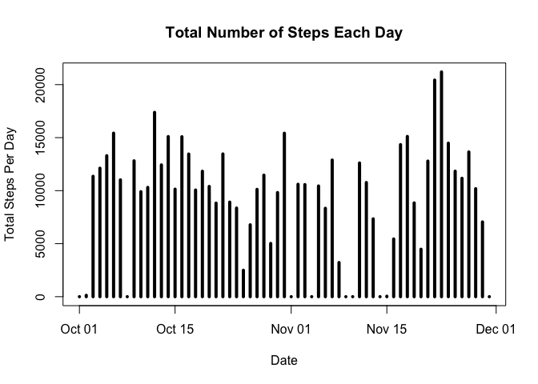
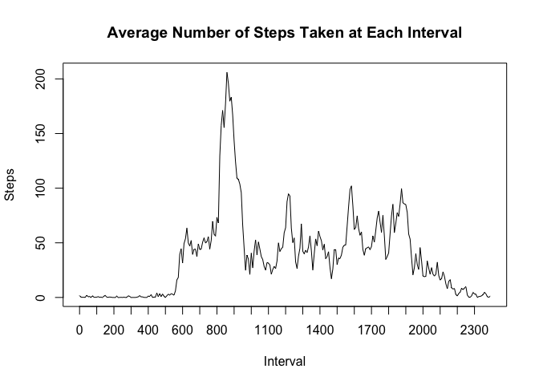
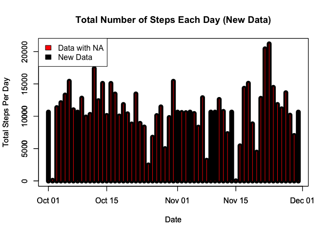
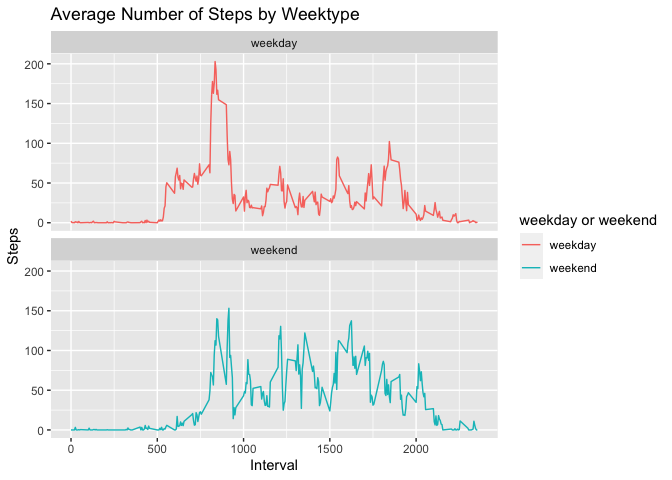

Can access through - https://rpubs.com/hcsylvester/617710  

---
title: "Reproducible Research Course Project 1"
output: 
        html_document:
                keep_md: true 
---

## Intro
It is now possible to collect a large amount of data about personal movement using activity monitoring devices such as a Fitbit, Nike Fuelband, or Jawbone Up. These type of devices are part of the “quantified self” movement – a group of enthusiasts who take measurements about themselves regularly to improve their health, to find patterns in their behavior, or because they are tech geeks. But these data remain under-utilized both because the raw data are hard to obtain and there is a lack of statistical methods and software for processing and interpreting the data.

This assignment makes use of data from a personal activity monitoring device. This device collects data at 5 minute intervals through out the day. The data consists of two months of data from an anonymous individual collected during the months of October and November, 2012 and include the number of steps taken in 5 minute intervals each day.

The data for this assignment can be downloaded from the course web site:

Dataset: Activity Monitoring Data: https://d396qusza40orc.cloudfront.net/repdata%2Fdata%2Factivity.zip [52K]

The variables included in this dataset are:

steps: Number of steps taking in a 5-minute interval (missing values are coded as \color{red}{\verb|NA|}NA)
date: The date on which the measurement was taken in YYYY-MM-DD format
interval: Identifier for the 5-minute interval in which measurement was taken
The dataset is stored in a comma-separated-value (CSV) file and there are a total of 17,568 observations in this dataset.

## Load Packages needed for programming

```r
library(ggplot2)
library(plyr)
library(dplyr)
```

```
## 
## Attaching package: 'dplyr'
```

```
## The following objects are masked from 'package:plyr':
## 
##     arrange, count, desc, failwith, id, mutate, rename, summarise,
##     summarize
```

```
## The following objects are masked from 'package:stats':
## 
##     filter, lag
```

```
## The following objects are masked from 'package:base':
## 
##     intersect, setdiff, setequal, union
```

```r
library(data.table)
```

```
## 
## Attaching package: 'data.table'
```

```
## The following objects are masked from 'package:dplyr':
## 
##     between, first, last
```

## Loading Data
In my case data should be in your working directory.  


```r
activity <- read.csv("activity.csv", header = T)
```

##Check to see what data looks like

```r
head(activity)
```

```
##   steps       date interval
## 1    NA 2012-10-01        0
## 2    NA 2012-10-01        5
## 3    NA 2012-10-01       10
## 4    NA 2012-10-01       15
## 5    NA 2012-10-01       20
## 6    NA 2012-10-01       25
```

##What is mean total numbe rof steps takn per day?

1. Calculate the toal number of steps taken per day

```r
activity$date <- as.Date(activity$date)

total_steps_per_day <- activity %>% group_by(date) %>% summarize(total_steps = sum(steps, na.rm = T)) 

print(total_steps_per_day)
```

```
## # A tibble: 61 x 2
##    date       total_steps
##    <date>           <int>
##  1 2012-10-01           0
##  2 2012-10-02         126
##  3 2012-10-03       11352
##  4 2012-10-04       12116
##  5 2012-10-05       13294
##  6 2012-10-06       15420
##  7 2012-10-07       11015
##  8 2012-10-08           0
##  9 2012-10-09       12811
## 10 2012-10-10        9900
## # … with 51 more rows
```

2. If you do not understand the difference between a histogram and a barplot, research the difference between them. Make a histogram of the total number of steps taken each day


```r
plot(total_steps_per_day, main = "Total Number of Steps Each Day", type = 'h', 
     xlab = "Date", lwd = 4,
     ylab = "Total Steps Per Day")
```

<!-- -->

3. Calculate and report the mean and median of the total number of steps taken per day

```r
mean_steps <- mean(total_steps_per_day$total_steps)
print(mean_steps)
```

```
## [1] 9354.23
```

```r
median_steps <- median(total_steps_per_day$total_steps)
print(median_steps)
```

```
## [1] 10395
```

##What is the average daily activity pattern?

1. Make a time series plot (i.e. \color{red}{\verb|type = "l"|}type = "l") of the 5-minute interval (x-axis) and the average number of steps taken, averaged across all days (y-axis)

```r
#Subset intervals with means similar to as before
act_interval <- activity %>% group_by(interval) %>% summarize(total_steps = mean(steps, na.rm = T)) 

#Create time series plot average daily activity pattern
plot(x = 1:nrow(act_interval), y = act_interval$total_steps, type = "l", xaxt = "none", 
     main = "Average Number of Steps Taken at Each Interval", 
     xlab = "Interval",
     ylab = "Steps")
axis(1, labels = act_interval$interval[seq(1, 288, 12)], 
     at = seq_along(act_interval$interval)[seq(1, 288, 12)])
```

<!-- -->

2. Which 5-minute interval, on average across all the days in the dataset, contains the maximum number of steps?

```r
max_interval <- filter(act_interval, total_steps == max(total_steps))
```

##Imputing Missing Values

1. Calculate and report the total number of missing values in the dataset (i.e. the total number of rows with \color{red}{\verb|NA|}NAs)

```r
#Find number of missing values
total_nas <- sum(is.na(activity$steps))

print(total_nas)
```

```
## [1] 2304
```

2. Devise a strategy for filling in all of the missing values in the dataset. The strategy does not need to be sophisticated. For example, you could use the mean/median for that day, or the mean for that 5-minute interval, etc.

```r
#Create strategy to fill in missing values, will use mean value for that day
activity <- data.table::fread("activity.csv")

#Need to change date format or else plot will not work
activity$date <- as.Date(activity$date)
activity[is.na(steps), "steps"] <- activity[, c(lapply(.SD, mean, na.rm = T)), .SDcols = c("steps")]
```

```
## Warning in `[<-.data.table`(`*tmp*`, is.na(steps), "steps", value =
## structure(list(: 37.382600 (type 'double') at RHS position 1 truncated
## (precision lost) when assigning to type 'integer' (column 1 named 'steps')
```


3. Make a histogram of the total number of steps taken each day and Calculate and report the mean and median total number of steps taken per day. Do these values differ from the estimates from the first part of the assignment? What is the impact of imputing missing data on the estimates of the total daily number of steps?

```r
total_steps_per_day_2 <- activity %>% group_by(date) %>% summarize(total_steps = sum(steps, na.rm = T))
total_steps_per_day_2
```

```
## # A tibble: 61 x 2
##    date       total_steps
##    <date>           <int>
##  1 2012-10-01       10656
##  2 2012-10-02         126
##  3 2012-10-03       11352
##  4 2012-10-04       12116
##  5 2012-10-05       13294
##  6 2012-10-06       15420
##  7 2012-10-07       11015
##  8 2012-10-08       10656
##  9 2012-10-09       12811
## 10 2012-10-10        9900
## # … with 51 more rows
```

```r
plot(total_steps_per_day_2, main = "Total Number of Steps Each Day (New Data)", type = 'h', 
     xlab = "Date", lwd = 10,
     ylab = "Total Steps Per Day")

#Mean and Median of new data 
mean_steps_2 <- mean(total_steps_per_day_2$total_steps)
print(mean_steps)
```

```
## [1] 9354.23
```

```r
median_steps_2 <- median(total_steps_per_day_2$total_steps)
print(median_steps)
```

```
## [1] 10395
```

```r
#Contrast with old data and new data
par(new = T)
plot(total_steps_per_day, type = 'h', lwd = 1, col = "red", add = T,
     xlab = "Date",  
     ylab = "Total Steps Per Day")
```

```
## Warning in plot.window(...): "add" is not a graphical parameter
```

```
## Warning in plot.xy(xy, type, ...): "add" is not a graphical parameter
```

```
## Warning in axis(side, at = z, labels = labels, ...): "add" is not a graphical
## parameter
```

```
## Warning in axis(side = side, at = at, labels = labels, ...): "add" is not a
## graphical parameter
```

```
## Warning in box(...): "add" is not a graphical parameter
```

```
## Warning in title(...): "add" is not a graphical parameter
```

```r
legend("topleft", c("Data with NA", "New Data"), fill = c("red", "black"))
```

<!-- -->


##Are there differences in activity patterns between weekdays and weekends?

1. Create a new factor variable in the dataset with two levels – “weekday” and “weekend” indicating whether a given date is a weekday or weekend day.

```r
activity <- data.table::fread(input = "activity.csv")

#Change date format for ease of subsetting
activity[, date := as.POSIXct(date, format = "%Y-%m-%d")]

activity[, `Day of Week`:= weekdays(x = date)]

activity[grepl(pattern = "Monday|Tuesday|Wednesday|Thursday|Friday", x = `Day of Week`), "weekday or weekend"] <- "weekday"

activity[grepl(pattern = "Saturday|Sunday", x = `Day of Week`), "weekday or weekend"] <- "weekend"

activity[, `weekday or weekend` := as.factor(`weekday or weekend`)]

activity[is.na(steps), "steps"] <- activity[, c(lapply(.SD, median, na.rm = TRUE)), 
                                            .SDcols = c("steps")]

#Subset between intervals by weekday and weekend
Inter <- activity[, c(lapply(.SD, mean, na.rm = TRUE)), .SDcols = c("steps"), 
                  by = .(interval, `weekday or weekend`)] 
```

2. Make a panel plot containing a time series plot (i.e. \color{red}{\verb|type = "l"|}type = "l") of the 5-minute interval (x-axis) and the average number of steps taken, averaged across all weekday days or weekend days (y-axis). See the README file in the GitHub repository to see an example of what this plot should look like using simulated data.

```r
#Plot between weekday and weekend
ggplot(Inter , aes(x = interval , y = steps, color =`weekday or weekend`)) + 
        geom_line() + 
        labs(title = "Average Number of Steps by Weektype", x = "Interval", y = "Steps") + 
        facet_wrap(~`weekday or weekend` , ncol = 1, nrow = 2)
```

<!-- -->


